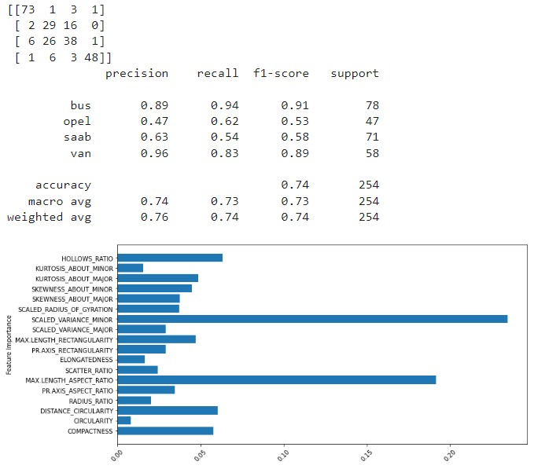

# Predicting vehicle type or class using Machine Learning
Think that you work for an Automotive company and you want to develop a system that should recognize and classify different types of vehicles based on their attributes automatically. These properties may be compactness, circularity, aspect ratios, and more, depending on the data set we use... And your aim is to build an ML model that could accurately classify the vehicles into their specific classes such as Bus, car, truck, etc.
# Aim
To develop and evaluate a Machine Learning  model that could classify vehicles based on their features 
# Major steps
1. # Data Preparation:
     Loading the sample dataset about the information about the vehicles and their features. I used the sample data from the website:https://datahub.io/machine-learning/vehicle#resource-vehicle_zip
2. # Feature Selection:
   select the relevant features that would be important for differentiating between the different types of vehicles.
3. # Data Splitting:
   The dataset is divided into two sets, that is training set and testing set. the training set is used to teach the machine learning model, and the testing set is used to evaluate how well the model can generalize its learning for the new unseen dataset with the features
4. # Model Training:
   The program initializes a Decision Tree Classifier, a type of machine learning model and it trains this classifier using the training Data and the selected features.
5. # Model Evaluation:
   Now the the trained model is evaluated using the testing set. The program calculates and displays the metrics such as confusion matrix and also gives classification reports which contain insights into how well the model performs in classifying different vehicle types.
6. # Feature Importance Analysis
   The program analyzes the feature importance scores from the trained model. This helps identify which attributes play a crucial role in the model's classification decisions.
7. # Visualization:
   The program creates a horizontal bar plot to visualize the importance of each feature. This plot provides a graphical representation of which attributes are most influential in determining the class of a vehicle.

# TECHNOLOGIES USED
Python,
Pandas,
Scikit-learn(sklearn),
Matplotlib,
CSV.

# Result

